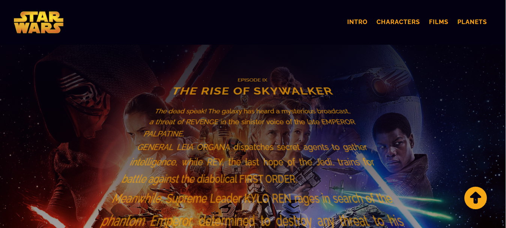
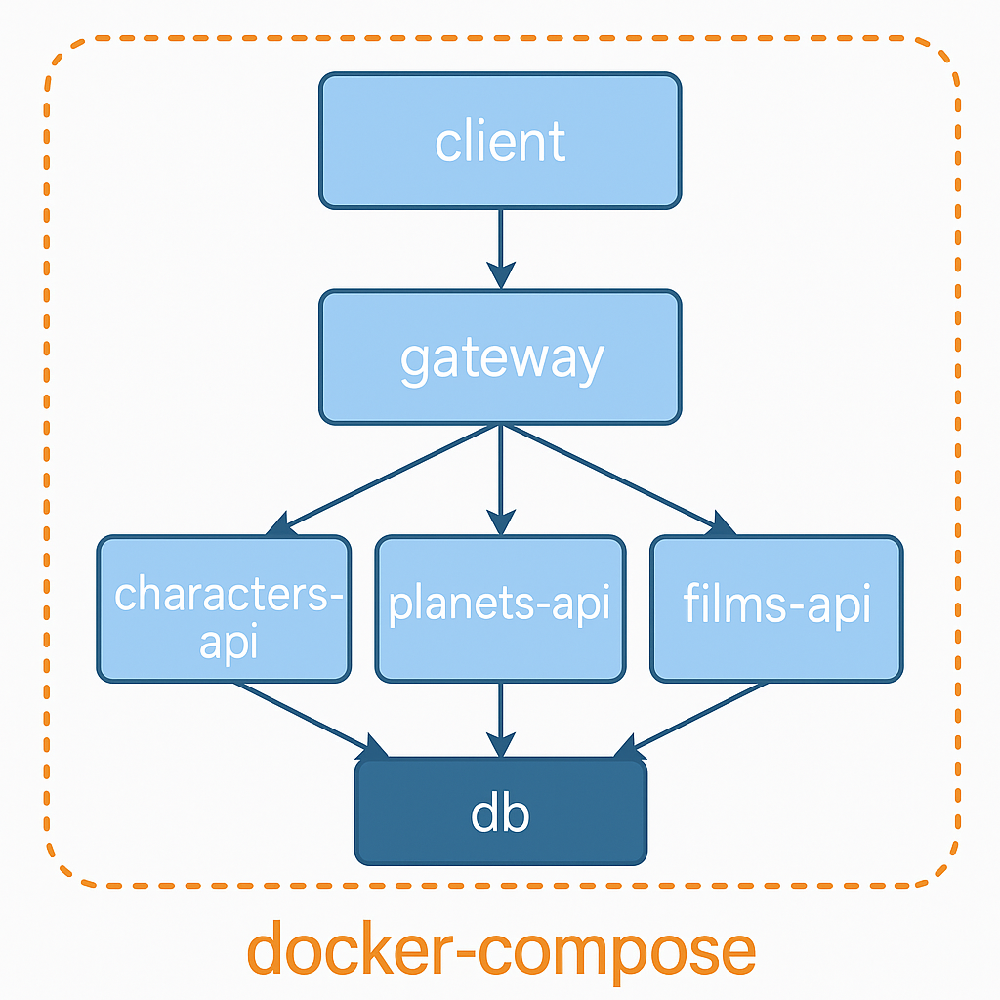

# AYI - Curso: Docker - Docker Compose

<figure>
    
</figure>

# Objetivos teóricos a desarrollar
Orquestación de contenedores a traves de docker-compose. Publicación de imagenes en Docker Hub. 

## Arquitectura de Microservicios:

* Node.js
* Express
* MongoDB
* Docker
* Docker Compose

<figure>
    
</figure>

### Sobre el Proyecto

_Expone listados de algunos personajes, planetas y films en los cuales intervinieron los personajes de Star Wars._
_Permitirá realizar busquedas por el nombre de cada una de las entidades. Filtrado de personajes segun el planeta de origen._
### Modelos

_Se utiliza base de datos NoSQL, en este caso MongoDB y ORM Mongoose, con clúster alojado en MongoDB Atlas._
_Los modelos para este proyecto son: Character, Film y Planet._
_Cada modelo incluye sus métodos estaticos._

### Servicios

#### characters
- Descripción : Este servicio soporta las peticiones referidas a los personajes de Star Wars.
- Tecnología : Api Rest, Node, Express, javascript.

- Funcionalidad : Manejo de tareas: Creación, Listado, Detalle y Borrado.

- Modelo : colección "characters" que maneja documentos de tipo “Character” que contienen referencias al planeta de nacimiento y a los films en los cuales intervino el personaje.

- Base de datos : MongoDB - Mongo DB Atlas.

#### Similares caracteristicas para los modelos: "films" y "planets.
### Gateway

- Descripción : Servicio encargado de centralizar las llamadas a los demás servicios a través de una URI que hace de entrada a esas peticiones.
- Tecnología : Api Rest, Node, Express, http-proxy-middleware.
- Funcionalidad : Se encarga de centralizar las llamadas a la aplicación en una URI principal que redirige las llamadas a los servicios configurados internamente.

## Contenedores
### Docker - Creacion y Ejecución de imágines

1. creacion de archivo Dockerfile.

2. Creacion del archivo .dockerignore

3. Creacion de imágen:  docker build -t "nombre-imagen"

4. Levantar la imagen: docker run -p PORT:PORT "nombre-imagen"

### Docker Compose

_Es una herramienta que facilita la orquestación y gestión de aplicaciones basadas en contenedores Docker._
-Proporciona una forma sencilla y declarativa de definir y ejecutar servicios compuestos por múltiples contenedores._

1. Creacion del archivo en la raiz del directorio del proyecto: docker-compose.yml
_Este archivo contendrá la direccion de todas las imagenes que queremos gestionar. (characters, films, planets, gateway, database, etc)._

2. Creacion del contenedor: 
        - docker-compose build

3. Levantar el contenedor: 
        - docker-compose up

4. Detener y eliminar el contenedor: 
        - docker-compose down

