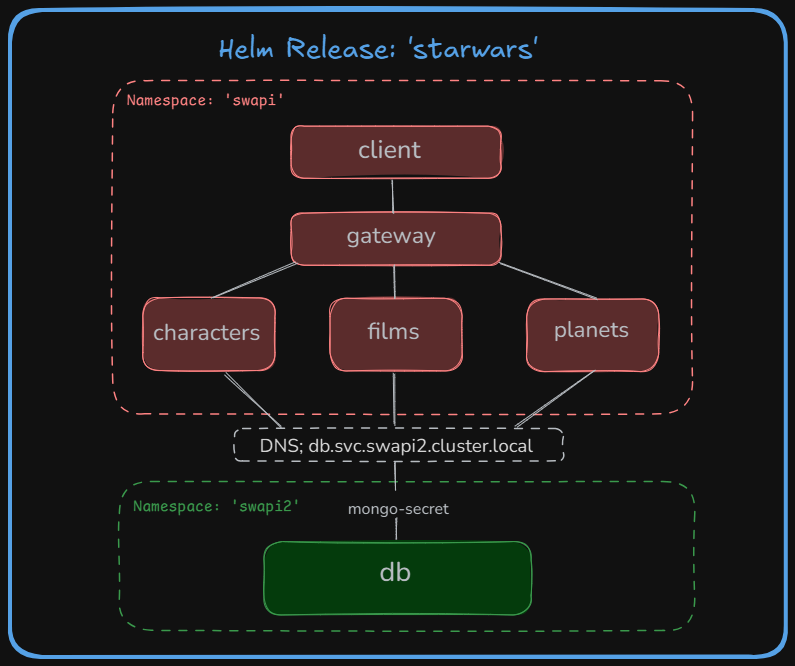

# ⭐ Star Wars Deploy de Microservicios

## 📁 Estructura

```
/mi-app/
├── api/
│   ├── gateway/
│   ├── characters/
│   ├── films/
│   ├── planets/
│   └── db/
│
├── client/                  # Frontend React
│
├── helm/                    # Helm chart para el despliegue
│   ├── templates/
│   │   ├── characters-deployment.yaml
│   │   ├── films-deployment.yaml
│   │   ├── planets-deployment.yaml
│   │   ├── gateway-deployment.yaml
│   │   ├── client-deployment.yaml
│   │   ├── db-deployment.yaml
│   │   ├── services/*.yaml
│   ├── values.yaml
│   └── Chart.yaml
│
└── docker-compose.dev.yml 
```
<p align="center">
  
</p>

## ⚙️ Descripción general
- Frontend: React (client)

- Backend: Node.js microservicios (characters, films, planets), gateway

- Base de datos: Mongo Atlas, accesible mediante un servicio db en swapi2 namespace.

- Orquestador: Kubernetes

- Gestión de despliegues: Helm


## 🚀 Pasos de despliegue
1. Crear Namespaces
```bash
kubectl create namespace swapi
kubectl create namespace swapi2
```

2. Crear Secrets para MONGO_URI (sin exponer clave en YAML)
```bash
kubectl create secret generic mongo-secret \
  --from-literal=MONGO_URI='mongodb+srv://<user>:<pass>@cluster.mongodb.net/starwars' \
  -n swapi2
```

3. Construir y subir imágenes a Docker Hub
Desde cada microservicio:
```bash
docker build -t <tu-user-dockerhub>/<nombre-microservicio>:latest .
docker push <tu-user-dockerhub>/<nombre-microservicio>:latest
```

4. Instalar con Helm
✅ Para el backend + frontend (namespace swapi):
```bash
helm install starwars ./helm -n swapi --create-namespace --set db.enabled=false
```

✅ Para el backend (namespace swapi2):
```bash
helm install starwars ./helm -n swapi2 --create-namespace --set client.enabled=false --set gateway.enabled=false --set characters.enabled=false --set films.enabled=false --set planets.enabled=false
```

5. Verificar releases
```bash
helm list -A
```

6. Acceder a la app
Si se expone con NodePort:
```bash
minikube service starwars-client -n swapi
```

## 🔄 Desinstalación
```bash
helm uninstall starwars -n swapi
helm uninstall starwars-db -n swapi2
```

## 📝 Notas
* Namespaces: swapi (servicios + frontend), swapi2 (base de datos).

* Gateway: Es el único microservicio que expone públicamente el backend.

* Client: Conecta al Gateway, se expone con NodePort.

* Variables sensibles: almacenadas en Secrets.


## 📌 Requisitos
* Docker Desktop + Kubernetes habilitado o Minikube

* Helm >= v3.0

* Acceso a Mongo Atlas (o base compatible)

